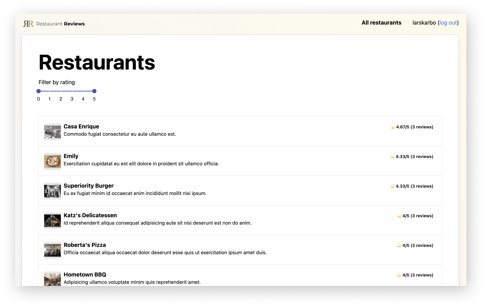

# Restaurant Reviews




----

This project consists of a **frontend** and a **backend**.

## Installation

First, be sure to install [Yarn](https://classic.yarnpkg.com/en/docs/install/#mac-stable) and [Node.js](https://nodejs.org/en/download/) (12+).

### Server setup

Navigate to the `server` folder of this project.

```
cd server
```

Install dependencies with Yarn.

```
yarn
```

And run the server.

```
yarn run
```

Congratulations! It should now show the message "Listening to port 3200".

### Frontend setup

Change directory so that you are in the project root.

Then install dependencies with yarn.

```
yarn
```

And run the app.

```
yarn start
```

It should now pop up at http://localhost:3000

## Default users

To test, feel free to use these test accounts:

Normal user - username:`larskarbo` password:`asdf`

Normal user - username:`goatman` password:`asdf`

Owner - username:`owner1234` password:`asdf`

Owner - username:`superowner` password:`asdf`

Amind - username:`admin` password:`asdf`

## Production

Make sure to set the environment variable `ACCESS_TOKEN_SECRET` before deploying to production.

This can be done by adding a file `.env` to the `server` folder in this format:

```bash
ACCESS_TOKEN_SECRET=swsh2fdsdf3hjdddsfsdaofijsfddsofijsodifjnnssafoidjsf
```

The CORS origin setting in `server/app.js` should also be updated to point to the actual domain, and not localhost.

## Specs

- User must be able to create an account and log in. (If a mobile application, this means that more users can use the app from the same phone).
- Implement 3 roles with different permission levels
    * Regular User: Can rate and leave a comment for a restaurant
    * Owner: Can create restaurants and reply to comments about owned restaurants
    * Admin: Can edit/delete all users, restaurants, comments, and reviews
- Reviews should have:
    * A 5 star based rating
    * Date of the visit
    * Comment 
- When a Regular User logs in, they will see a Restaurant List ordered by Average Rating
- Restaurant List can be filtered by Rating
- When an Owner logs in, they will see a Restaurant List - only the ones owned by them, and the reviews pending reply
- Owners can reply to each review once
- Restaurants detailed view should have:
    * The overall average rating
    * The highest rated review
    * The lowest rated review
    * Last reviews with rate, comment, and reply
- REST API. Make it possible to perform all user actions via the API, including authentication.
- In any case, you should be able to explain how a REST API works and demonstrate that by creating functional tests that use the REST Layer directly. Please be prepared to use REST clients like Postman, cURL, etc. for this purpose.
- If it’s a web application, it must be a single-page application. All actions need to be done client-side using AJAX, refreshing the page is not acceptable.
- Functional UI/UX design is needed. You are not required to create a unique design, however, do follow best practices to make the project as functional as possible.
- Bonus: unit and e2e tests.